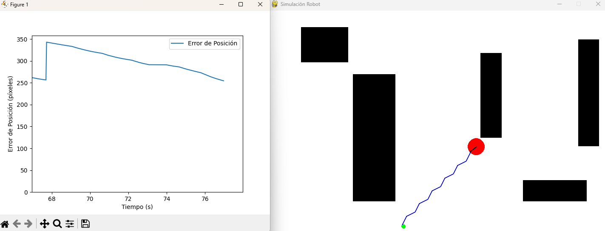

# Simulación de Robot Móvil Diferencial 🚗🤖
[Simulación del Robot](assets/simulacion.png)
## Descripción

Este proyecto es una simulación interactiva de un **robot móvil diferencial** utilizando **Python**, **Pygame** y **Matplotlib**. El robot se mueve en un entorno 2D y es capaz de planificar rutas evitando obstáculos para llegar a un objetivo especificado por el usuario.

### Características Principales

- **Modelo Cinemático Diferencial:** Simula el comportamiento real de un robot con dos ruedas motrices independientes.
- **Control PID:** Utiliza un controlador PID para ajustar la orientación del robot hacia el objetivo de manera suave y eficiente.
- **Planificación de Rutas con A\*:** Implementa el algoritmo A\* para encontrar la ruta óptima evitando obstáculos.
- **Interfaz Interactiva:**
  - **Agregar Obstáculos:** Añade obstáculos haciendo clic y arrastrando el ratón mientras mantienes presionada la tecla **Shift**.
  - **Establecer Objetivo:** Haz clic izquierdo para establecer un nuevo objetivo para el robot.
  - **Eliminar Obstáculos:** Haz clic derecho sobre un obstáculo para eliminarlo.
- **Visualización en Tiempo Real:**
  - Muestra la ruta planificada y el movimiento del robot.
  - Gráfica en tiempo real del error de posición utilizando Matplotlib.

## Capturas de Pantalla

*Simulación del robot móvil evitando obstáculos y siguiendo la ruta planificada.*

## Tecnologías Utilizadas

- **Python  3.12.4**
- **Pygame**
- **Matplotlib**
- **NumPy**

## Requisitos

Antes de ejecutar el programa, asegúrate de tener instaladas las siguientes bibliotecas:

- **Pygame**
- **Matplotlib**
- **NumPy**

